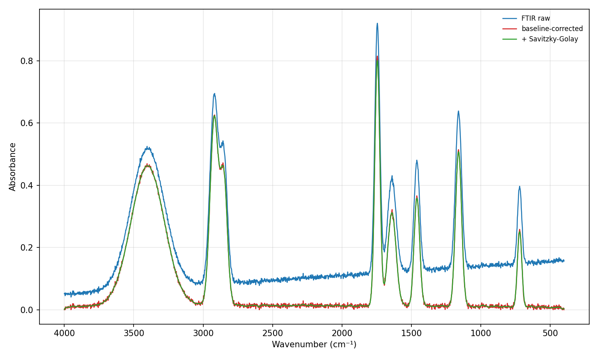
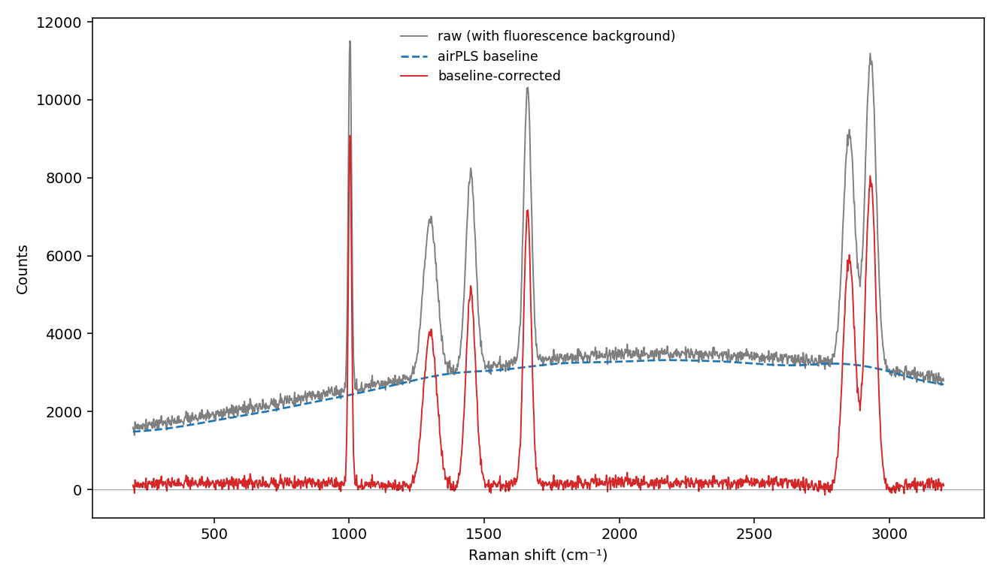
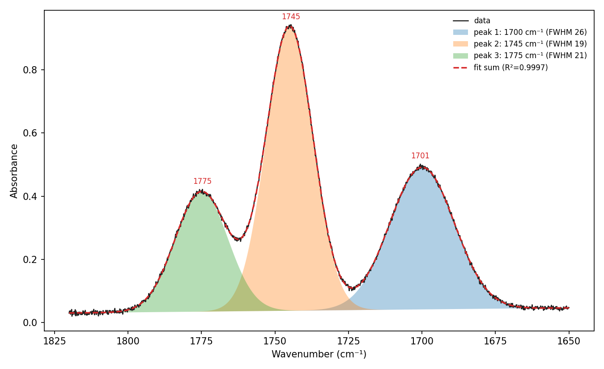
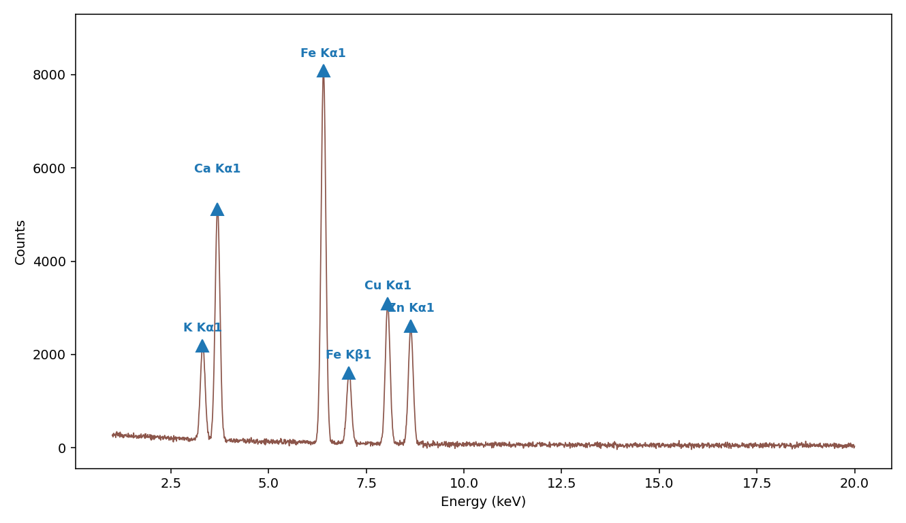
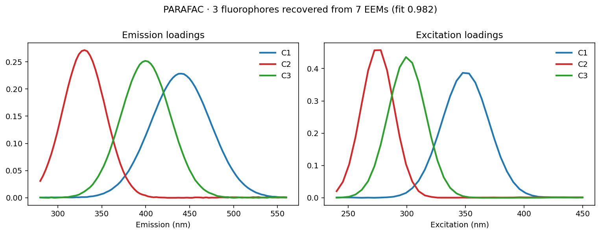
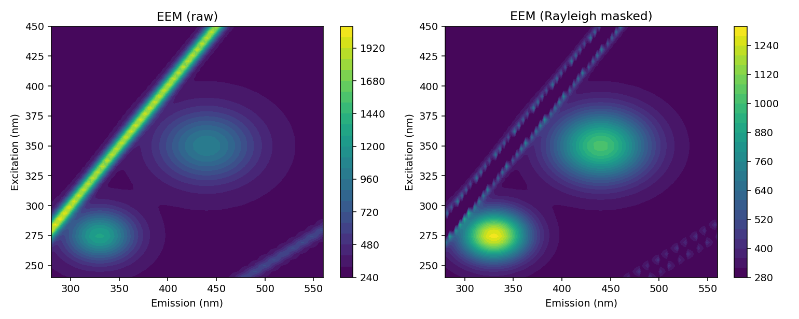
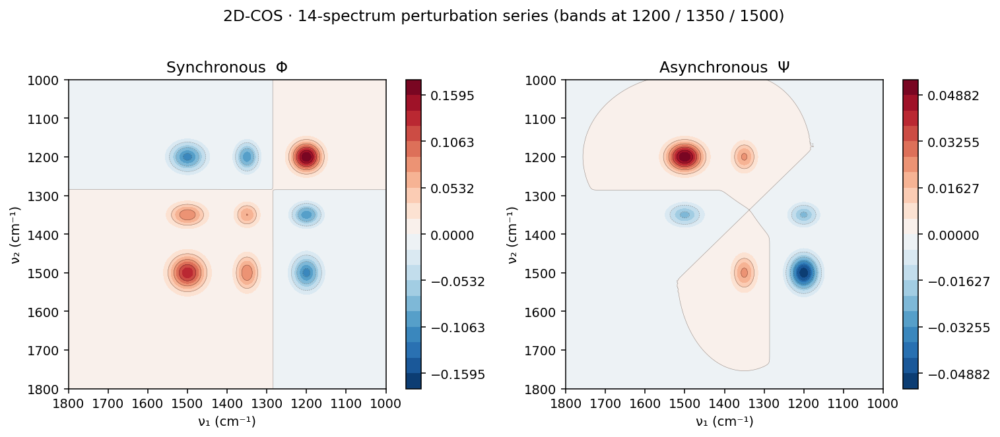

# SpectraView

[](https://github.com/Tai-ShengYeh/spectraview/actions/workflows/tests.yml)
[](LICENSE)

📖 **教學頁：[光譜 × 食品分析（化學計量學）](https://tai-shengyeh.github.io/spectraview/)** ｜ 課程入口：[食品科學教學課程](https://tai-shengyeh.github.io/) ｜ 📝 [更新說明（Changelog）](CHANGELOG.md)

一個受 [SpectraGryph](https://www.effemm2.de/spectragryph/) 啟發、用 Python 寫的**桌面光譜檢視與處理程式**。
專為食品分析 / 儀器分析教學與研究設計，可載入、疊圖檢視、換算座標軸、做前處理的
FTIR、Raman、UV-Vis、NIR、XRF/LIBS 等光譜。



> 上圖：同一條 FTIR 光譜的「原始 / 基線校正 / Savitzky-Golay 平滑」三條疊圖，X 軸依 IR 慣例由高波數往低波數。

---

## 安裝

需要 Python 3.10+。

```bash
cd spectra_viewer
pip install -r requirements.txt
```

核心套件：`numpy`、`scipy`、`PySide6`、`pyqtgraph`、`matplotlib`。
二進位格式（SPC、較特殊的 Bruker OPUS 變體）為選用套件，未安裝時程式會給清楚的安裝提示而非崩潰；
Bruker OPUS 一維光譜、Bruker PDZ XRF、Shimadzu SPC/ISPD 與 PerkinElmer SP/ASC 可純 Python 讀取。
（`spc-spectra` 的舊式建置會在隔離環境找不到 numpy，請用
`pip install --no-build-isolation spc-spectra`。）

### macOS（Mac 電腦）

適用 Apple 晶片（M1/M2/M3…）與 Intel Mac。建議用 [Homebrew](https://brew.sh/) 安裝 git 與 Python，再用虛擬環境執行：

```bash
# 1) 安裝 Homebrew（若已安裝可略過）
/bin/bash -c "$(curl -fsSL https://raw.githubusercontent.com/Homebrew/install/HEAD/install.sh)"

# 2) 安裝 git 與 Python 3.12
brew install git python@3.12

# 3) 取得程式碼
git clone https://github.com/Tai-ShengYeh/spectraview.git
cd spectraview

# 4) 建立虛擬環境並安裝相依套件
python3 -m venv .venv
source .venv/bin/activate
pip install -r requirements.txt

# 5) 啟動
python run.py
```

macOS 請使用 `python3` / `pip3` 指令（系統內建的 `python` 可能不存在或為舊版）。
下次要再開程式：`cd spectraview && source .venv/bin/activate && python run.py`。

## 執行

```bash
python run.py                 # 開啟程式
python run.py file1.dx a.csv  # 開啟並直接載入這些光譜
```

或在程式啟動後，直接把檔案**拖放**到視窗，或用 **File ▸ Load demo spectra** 載入內建示範光譜立即試玩。
SOPRANO 線上光譜庫可用 **File ▸ Open SOPRANO URL…** 貼上網址後直接讀取並繪圖。

---

## 功能（v1）

### 檢視核心
- **多格式載入**：ASCII（CSV/TXT/DAT/TSV/PRN/ASC/XY）、JCAMP-DX（.dx/.jdx，含 ASDF 壓縮）、
  JSON（多種結構：x/y 陣列、別名鍵、pairs、`spectra` 多光譜）、MATLAB（.mat，含命名變數
  與 N×2 / N×M 矩陣）、GRAMS／Shimadzu UV-Vis SPC（.spc，自動辨識兩種格式；Shimadzu 為純 Python）、
  Bruker OPUS（.0/.1…，含 Raman 一維光譜）、Bruker PDZ XRF（.pdz，純 Python）、
  Shimadzu ISPD（.ispd，FTIR）、NeoSpectra（.Spectrum，NIR 匯出）、
  PerkinElmer（.sp 二進位、.asc PEDS——皆純 Python；.asc 直接讀 #GR 座標單位、.dx 走 JCAMP），
  以及 SOPRANO 線上光譜庫頁面（從網址讀取內嵌 Dygraph 光譜資料）。
  一個檔可含多條光譜。
- **疊圖檢視**：多光譜同圖、各自顏色與圖例；左側清單可勾選顯示/隱藏、雙擊改色、改名。
- **互動**：滑鼠縮放/平移、自動縮放（Ctrl+0）、十字游標即時讀出座標（狀態列），游標停在曲線上會浮現該光譜名稱。
- **座標軸換算**
  - X：波長 nm ↔ 波數 cm⁻¹ ↔ 波長 µm ↔ Raman 位移 cm⁻¹（需雷射波長）↔ 能量 eV ↔ 頻率 THz
  - Y：穿透率 ↔ 穿透率% ↔ 吸光度 ↔ 反射率 ↔ Kubelka-Munk ↔ log(1/R)
- **顯示選項**：堆疊位移（Scale & Shift）、翻轉 X 軸、格線、對數 Y、深色背景、隱藏/顯示左側光譜清單（F9）。
- **匯出**：圖檔 PNG（WYSIWYG）與 SVG / PDF / EPS 向量圖（publication 等級）；
  單一光譜存成 CSV 或 JCAMP-DX；**合併匯出**（File ▸ Export combined data）把多條
  光譜放到共用波長軸後輸出成一個 CSV——可選「波長欄 + 每條一欄」或「每條一列的 X-matrix」
  （直接餵 sklearn PLS/PCA）。**兩種版面都能再載回**；外部工具（如 Orange）匯出的
  矩陣 CSV（表頭為波長軸、每列一條光譜）也會自動辨識並逐列載入成多條光譜。

### 前處理（可作用於選取的光譜，未選取則套用全部）
- **平滑**：Savitzky-Golay、移動平均
- **基線校正**：Rubberband（凸包）、多項式（ModPoly 疊代）、非對稱最小平方 ALS（Eilers）、
  **airPLS**（Zhang 2010；對螢光背景特別有效，預設 porder=2）
- **微分**：1–4 階（Savitzky-Golay）
- **正規化**：峰值=1、Min-Max(0..1)、面積=1、向量(L2)、指定 x₀ 處=1
- **散射校正**：SNV、MSC（對平均光譜）、detrend
- **光譜運算**：兩條相加/減/乘/除（自動對齊重疊區）、平均（mean/median）
- **轉換**：裁切 x 範圍、重採樣到均勻格點
- **復原/重做**：每步處理皆可 Undo/Redo（Ctrl+Z / Ctrl+Y）



> airPLS 把 Raman 的螢光背景（藍色估計基線）扣掉，尖峰完整保留、落在零線。

### 分析（v2，Analyze 選單）
- **尋峰**：自動偵測峰（或谷）、量測 FWHM、近似面積；在圖上標峰位、並彈出
  可匯出 CSV 的峰表。可調最小高度/突出度/間距、選擇性預平滑。
- **峰形擬合 / 去卷積**：以**自動尋峰當初值**，擬合 Gaussian / Lorentzian /
  Pseudo-Voigt 的疊加（可選同時擬合線性基線）；圖上疊出各分量（虛線）與加總、
  附 R² 與每峰中心/高度/FWHM/面積的表；一鍵把**擬合分量存回光譜清單**。
- **區間積分**：指定 x 範圍、可減端點線性基線，算面積與重心，並在圖上標示積分區。
- **混合物濃度（NNLS）**：以純物質參考譜，用非負最小平方解 mixture ≈ Σ cᵢ·refᵢ，
  回報各成分係數、正規化比例與 R²，並疊出重建譜。參考譜可來自選取的光譜或光譜庫。
- **XRF 元素鑑定**：對 keV（或 eV）能量軸的 XRF 譜尋峰，比對內建特徵譜線表
  （Kα/Kβ/Lα/Lβ，常見元素 Z=11–92），在圖上標出元素（如 Fe Kα1）並附比對表。
- **檢量線（calibration curve）**：用一組已知濃度的標準品建迴歸、回推未知樣品濃度
  （比爾定律 A = ε·b·c 的定量工作流）。訊號來源可選**指定波長處的值**（吸光度 @ λ）、
  **區間峰高**或**區間積分面積**；標準品濃度會從光譜名稱自動解析（如 `std 5 ppm`），
  並可在表格逐筆編輯，每條光譜標記為 standard / unknown。支援**線性、過原點、二次**模型，
  回報斜率、截距（各含標準誤）、R²、殘差標準誤 s(y/x)、**偵測極限 LOD = 3.3·s/斜率**、
  **定量極限 LOQ = 10·s/斜率**，以及每個未知樣品的濃度與 **95% 信賴區間**（Miller & Miller）。
  結果視窗畫出標準點 + 迴歸線 + 未知點（含信賴區間誤差棒），可匯出 CSV 與圖檔。



> 重疊的羰基（C=O）吸收帶被擬合拆解成三個 Gaussian 分量（R²≈0.9997）。



> XRF 譜自動標出對應元素（食品礦物 K / Ca / Fe / Cu / Zn）。

### 光譜庫與相似度比對（Library 選單）
- **自建光譜庫**：把載入的光譜「加入庫」，存成 `.speclib`（JSON）庫檔、之後可載入。
- **相似度搜尋**：拿未知譜對庫比對，依**相關係數**排序，命中清單同時顯示
  correlation / cosine / 光譜角 SAM / 歐氏距離，可一鍵把最佳命中疊到圖上。
- **現成範例**：[`examples/sugars_nir.speclib`](examples/) — 9 種糖類／添加物的 NIR 光譜庫（見下）。

> **範例：糖類 NIR 鑑別**
> [`examples/`](examples/) 內含一個用真實 DLP-Hadamard 近紅外（1600–2400 nm）量測建成的光譜庫：
> aspartame、benzoic acid、caffeine、fructose、glucose、lactose、maltose、sucralose、sucrose 共 9 種，
> 每條參考譜是該物質 **5 次重複的平均**；另附 `unknown_glucose.csv`、`unknown_sucrose.csv`、
> `unknown_caffeine.csv` 三個單次量測的查詢檔。
>
> **用法**：`Library ▸ Load library…` 載入 `sugars_nir.speclib` → `File ▸ Open…` 載入一個 `unknown_*.csv`
> → 在清單選它 → `Library ▸ Search selected against library…`。
>
> **結果**：留一驗證 **9/9** 全中；相關係數呈現化學上合理的分布——糖類彼此相似（蔗糖 vs 果糖 ≈ 0.99，
> 因為蔗糖＝葡萄糖＋果糖），但和添加物（咖啡因、苯甲酸 ≈ 0.7–0.87）明顯拉開。
> 線上另有[**互動比對 demo**](https://tai-shengyeh.github.io/spectraview/)，點按鈕即時看排名與疊圖，免安裝。

### 二維分析（Analyze 選單）
- **螢光 EEM**：讀 ex×em 矩陣檔或由多條發射光譜組成；2D 等高線熱圖（含色條、十字游標讀值）
  ＋可旋轉的 3D 表面；一鍵遮除 Rayleigh／Raman 散射脊。
- **2D 相關光譜（2D-COS）**：對一系列隨擾動變化的光譜，算同步 Φ＝DᵀD/(m−1) 與
  異步 Ψ＝Dᵀ·H·D/(m−1)（H=Hilbert-Noda 矩陣）相關圖；兩條譜用 **2T2D**
  （Φ=½(yₐ⊗yₐ+y_b⊗y_b)、Ψ=½(yₐ⊗y_b−y_b⊗yₐ)）。慣例同 shigemorita 2Dpy / R corr2D。
- **Hetero-correlation（異質相關）**：兩種不同技術（同一批樣品、同一擾動）做交叉
  二維相關，得非方陣 Φ／Ψ＝D₁ᵀD₂/(m−1)、D₁ᵀ·H·D₂/(m−1)。
- **EEM PARAFAC**：一疊多樣品 EEM 用平行因子分解（ALS，非負約束）盲解成各螢光成分的
  激發／發射輪廓與樣品分數；附每個成分的 rank-1 EEM 與分數表。



> PARAFAC 從 7 個混合 EEM 盲解出 3 個螢光團的激發/發射輪廓（fit≈0.98）。



> 螢光 EEM 等高線：左為原始、右為遮除 Rayleigh 散射脊後。



> 2D-COS 同步（對角自相關峰＋off-diagonal 交叉峰）與異步（反對稱、顯示變化先後）相關圖。

---

## 專案結構

```
spectra_viewer/
├── run.py                  啟動入口
├── requirements.txt
├── docs/demo.png
├── tests/
│   ├── smoke_test.py       核心邏輯自我測試（無需 GUI）
│   └── gui_smoke_test.py   headless（offscreen）GUI 測試
└── specview/
    ├── app.py              QApplication 設定 + 進入點
    ├── spectrum.py         Spectrum 資料模型 + SpectrumSet 文件
    ├── axes.py             座標軸換算（X、Y）
    ├── processing.py       所有前處理演算法（含 airPLS 基線）
    ├── analysis.py         尋峰 / 峰形擬合 / 積分 / 混合物 NNLS
    ├── calibration.py      檢量線（迴歸 + 濃度反推、LOD/LOQ、信賴區間）
    ├── library.py          光譜庫（.speclib）+ 相似度搜尋
    ├── xrf.py              XRF 元素譜線表 + 峰→元素比對
    ├── cos2d.py            2D 相關光譜（同步/異步 + 2T2D）
    ├── eem.py              螢光 EEM 模型 / 讀檔 / 散射移除
    ├── demo.py             內建示範光譜（FTIR/Raman/UV-Vis/NIR/XRF）
    ├── formats/            檔案 IO
    │   ├── __init__.py     依副檔名派發載入 + 存檔
    │   ├── ascii_io.py     ASCII 解析（偵測分隔符/表頭/多欄/歐規小數）
    │   ├── jcamp.py        自寫 JCAMP-DX 解析（AFFN/PAC/SQZ/DIF/DUP）
    │   ├── json_io.py      JSON 讀寫（多結構）
    │   ├── mat_io.py       MATLAB .mat 讀取（scipy.io）
    │   ├── _hints.py       JSON/MAT 共用：鍵名別名 + 單位正規化
    │   └── binary_io.py    GRAMS SPC（選用套件）+ OPUS / Shimadzu .SPC/.ispd / PerkinElmer .sp / PDZ（純 Python）
    └── ui/                 PySide6 + pyqtgraph 介面
        ├── main_window.py  主視窗、選單、工具列、清單、復原
        ├── plotview.py     繪圖區、十字游標、堆疊、匯出
        ├── mapwindow.py    2D 熱圖視窗（EEM/2D-COS）+ 3D 表面（matplotlib）
        ├── calibration_view.py  檢量線對話框 + 結果視窗
        └── dialogs.py      通用參數對話框
```

## 測試

```bash
python tests/smoke_test.py       # 模型 / 換算 / 處理 / 分析 / IO / JCAMP 解碼
python tests/gui_smoke_test.py   # 建視窗 / 載入 / 處理 / 換算 / 分析 / 匯出（offscreen）
```

---

## 設計說明

- **資料模型**：每條光譜 x 一律以遞增排序儲存；顯示端可獨立翻轉（IR/Raman 慣例由高往低）。
- **每個處理函式都回傳新的 Spectrum**，不改動輸入，配合文件層快照實作 Undo/Redo。
- **JCAMP-DX 自己解析**，不依賴第三方套件，支援真實 FTIR 檔常見的 DIF/SQZ/DUP 壓縮。
- **向量匯出走 matplotlib**（自帶字型、可輸出 PDF/EPS），比 pyqtgraph 的 SVG 寫出穩定。

## 尚未納入（下一步）

已完成：檢視 + 前處理（含 airPLS）、尋峰 / 峰形擬合 / 積分、混合物 NNLS、
光譜庫相似度比對、XRF 元素鑑定、**螢光 EEM（2D/3D）＋ PARAFAC**、
**2D-COS（含 2T2D、hetero-correlation）**、多格式 IO（含 JSON / MATLAB）。後續可加：
- **檢量線濃度**：用峰高或峰面積對「一系列已知濃度」建線、回推未知樣品（NNLS 之外的單變量定量）
- **EEM 進階**：Raman 散射內插填補、PARAFAC 成分數的 core-consistency 診斷
- **批次自動化**：把一串處理步驟套用到整批檔案
- **化學計量建模**：PLS / PCA（接 scikit-learn，配合「合併匯出」的 X-matrix）
- **XRF 能量校正**：channel/pixel 軸 → keV 的二點校正
